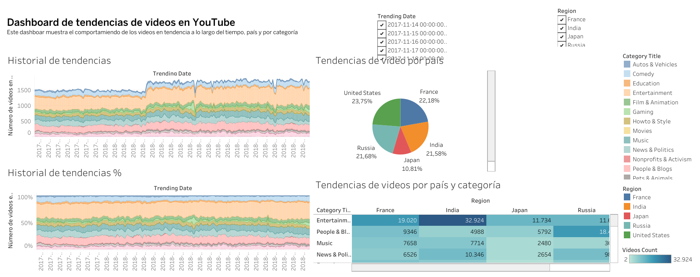
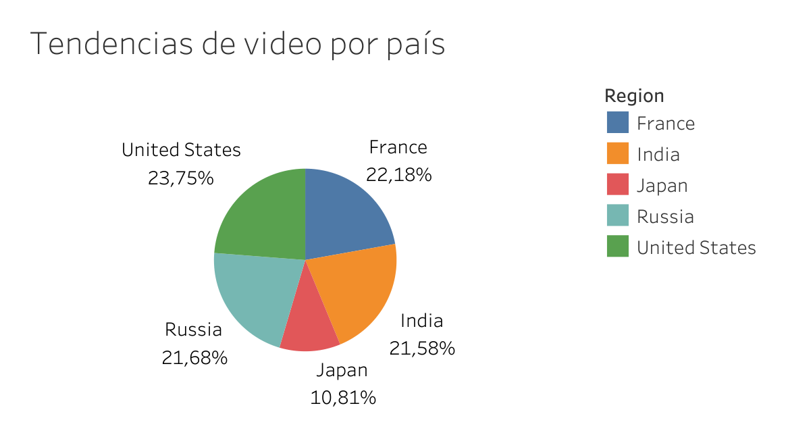
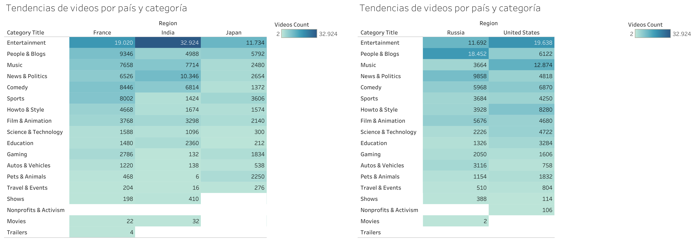

# Análisis de Tendencias de YouTube

Análisis de tendencias de videos en YouTube mediante **visualización de datos y Business Intelligence**, orientado a identificar patrones de consumo por país y categoría y facilitar la toma de decisiones de marketing.

El proyecto transforma datos agregados de tendencias en un **dashboard interactivo desarrollado en Tableau**, permitiendo analizar de forma visual qué tipos de contenido adquieren mayor presencia y cómo varía su comportamiento entre mercados.

---

## Dashboard interactivo

➡️ [Ver dashboard interactivo en Tableau Public](https://public.tableau.com/views/Libro1_17816548347860/Dashboard1?:language=es-ES&:sid=&:redirect=auth&:display_count=n&:origin=viz_share_link)

➡️ [Ver dashboard completo en PDF](dashboard/dashboard_tendencias_youtube.pdf)



---

## Objetivo

El proyecto busca facilitar el análisis periódico de tendencias de contenido en YouTube y responder preguntas como:

1. ¿Qué países concentran una mayor proporción de videos en tendencia?
2. ¿Qué categorías tienen mayor presencia?
3. ¿Cómo cambia la popularidad de las categorías entre diferentes mercados?
4. ¿Qué patrones pueden resultar útiles para orientar decisiones de marketing y contenido?

El objetivo final es convertir un conjunto de datos agregado en una herramienta visual que permita detectar tendencias rápidamente sin realizar análisis manuales repetitivos.

---

## Resumen ejecutivo

El dashboard muestra diferencias relevantes tanto entre países como entre categorías de contenido.

### Principales hallazgos

- **Estados Unidos** presenta la mayor participación sobre el total analizado, con aproximadamente **23.75%**.
- Le siguen **Francia (22.18%)**, **Rusia (21.68%)** e **India (21.58%)**, con participaciones relativamente similares.
- **Japón representa aproximadamente el 10.81%**, claramente por debajo del resto de mercados analizados.
- **Entertainment** destaca como una de las categorías con mayor presencia en varios países.
- India registra **32,924** videos en tendencia dentro de Entertainment, la combinación país-categoría más elevada observada en la visualización.
- Rusia presenta un comportamiento diferente: **People & Blogs** alcanza 18,452 registros, superando a Entertainment en ese mercado.
- Estados Unidos muestra además una presencia importante de **Music**, con 12,874 registros.

Estos resultados muestran que una misma estrategia de contenido no necesariamente tiene el mismo potencial en todos los mercados.

---

## Datos

El análisis utiliza:

`trending_by_time.csv`

El dataset contiene **12,343 registros** y cinco variables:

| Variable | Descripción |
|---|---|
| `record_id` | Identificador del registro |
| `region` | País o región |
| `trending_date` | Fecha en la que se registró la tendencia |
| `category_title` | Categoría del contenido |
| `videos_count` | Número de videos en tendencia |

Los mercados incluidos en el análisis son:

- Estados Unidos
- Francia
- India
- Japón
- Rusia

El dataset original no se redistribuye públicamente en este repositorio.

Más información en [`data/README.md`](data/README.md).

---

## Metodología

El proyecto se desarrolló siguiendo un enfoque de Business Intelligence:

1. Revisión de la estructura del dataset.
2. Identificación de las dimensiones principales:
   - fecha;
   - región;
   - categoría.
3. Identificación de la métrica principal:
   - número de videos en tendencia.
4. Conexión del dataset con Tableau.
5. Creación de visualizaciones por región y categoría.
6. Construcción de un dashboard interactivo.
7. Incorporación de filtros para facilitar la exploración de los datos.
8. Comparación de patrones entre mercados.
9. Interpretación de los resultados desde una perspectiva de marketing.

---

## Herramientas

- **Tableau**
- **Tableau Public**
- **Business Intelligence**
- **Data Visualization**
- **Marketing Analytics**

---

## Visualizaciones clave

### 1. Distribución de tendencias por país

La distribución general muestra una presencia relativamente equilibrada entre Estados Unidos, Francia, Rusia e India.

Japón presenta una participación considerablemente menor dentro del conjunto analizado.



| País | Participación |
|---|---:|
| Estados Unidos | 23.75% |
| Francia | 22.18% |
| Rusia | 21.68% |
| India | 21.58% |
| Japón | 10.81% |

---

### 2. Tendencias por país y categoría

La comparación entre categorías permite detectar diferencias importantes entre mercados.



Algunos patrones destacados:

- **Entertainment** presenta una presencia especialmente elevada en India, Estados Unidos, Francia y Japón.
- India registra **32,924** videos en tendencia de Entertainment.
- Estados Unidos alcanza **19,638** en Entertainment y **12,874** en Music.
- Francia registra **19,020** en Entertainment.
- Japón alcanza **11,734** en Entertainment.
- Rusia muestra un patrón diferente, con **People & Blogs (18,452)** por encima de Entertainment (11,692).

Esto evidencia que las categorías de mayor interés pueden variar considerablemente según el mercado.

---

## Insights de marketing

### 1. El mercado modifica el comportamiento del contenido

La popularidad de una categoría no es uniforme entre países.

Una categoría con fuerte presencia en un mercado puede tener un peso considerablemente menor en otro.

### 2. Entertainment tiene un alcance amplio

Entertainment aparece entre las categorías más relevantes en varios de los mercados analizados, lo que sugiere un elevado potencial para estrategias de contenido de amplio alcance.

### 3. Existen oportunidades específicas por país

Rusia destaca particularmente en **People & Blogs**, mientras que Estados Unidos muestra una presencia relevante de **Music** y otras categorías de entretenimiento.

Esto refuerza la necesidad de adaptar la estrategia de contenido al mercado en lugar de replicar una única estrategia internacional.

### 4. La visualización permite detectar patrones más rápidamente

Un dashboard centralizado reduce la necesidad de revisar manualmente los registros y facilita comparar países, categorías y evolución temporal desde una misma herramienta.

---

## Aplicación de negocio

Este tipo de análisis puede apoyar decisiones relacionadas con:

- planificación de campañas digitales;
- selección de categorías de contenido;
- estrategias de branded content;
- identificación de oportunidades por mercado;
- selección de mercados para campañas;
- adaptación regional de contenidos;
- seguimiento periódico de tendencias;
- planificación de inversión publicitaria.

Por ejemplo, una campaña internacional podría utilizar el dashboard para identificar qué categorías presentan mayor actividad en cada mercado antes de definir la estrategia creativa o la distribución del presupuesto.

---

## Recomendaciones

### Estrategia por mercado

Evitar utilizar únicamente tendencias globales para tomar decisiones locales.

Las diferencias observadas justifican analizar cada país individualmente antes de seleccionar categorías o formatos de contenido.

### Priorización de categorías

Utilizar las categorías con mayor presencia como punto de partida para identificar oportunidades de contenido, complementando el análisis con métricas de audiencia y desempeño cuando estén disponibles.

### Monitorización periódica

Actualizar regularmente el dashboard permitiría detectar cambios en las preferencias de contenido y reaccionar ante nuevas tendencias.

### Evolución del dashboard

Como siguiente paso, el análisis podría ampliarse incorporando:

- visualizaciones temporales más detalladas;
- evolución porcentual de categorías;
- rankings dinámicos;
- comparación entre periodos;
- métricas de visualizaciones, interacciones o engagement si estuvieran disponibles;
- indicadores KPI para facilitar el seguimiento ejecutivo.

---

## Entregables

### Dashboard

- [Dashboard completo en PDF](dashboard/dashboard_tendencias_youtube.pdf)
- [Dashboard interactivo en Tableau Public](https://public.tableau.com/views/Libro1_17816548347860/Dashboard1?:language=es-ES&:sid=&:redirect=auth&:display_count=n&:origin=viz_share_link)
### Visualizaciones adicionales

También se incluyen exportaciones específicas del análisis por país y categoría dentro de la carpeta `dashboard/`.

---

## Estructura del repositorio

```text
analisis-tendencias-youtube/
│
├── dashboard/
│   ├── dashboard_tendencias_youtube.pdf
│   ├── Tendencias de video por país.pdf
│   └── Tendencias de videos por país y categoría.pdf
│
├── data/
│   └── README.md
│
├── images/
│   ├── dashboard_tendencias_youtube.png
│   ├── tendencias_video_por_pais.png
│   └── tendencias_videos_pais_categoria.png
│
├── .gitignore
├── LICENSE
└── README.md
```

---

## Nota sobre los datos

El dataset fue utilizado con fines educativos para desarrollar un proyecto de análisis y visualización de datos.

El archivo CSV original no se redistribuye públicamente en este repositorio.

El dashboard, las visualizaciones, la documentación y las conclusiones desarrolladas para el proyecto sí están disponibles.

---

## Autor

Proyecto desarrollado como parte de un portafolio profesional de **Data Analytics**, con enfoque en **Marketing Analytics, Business Intelligence, Tableau y visualización de datos**.
